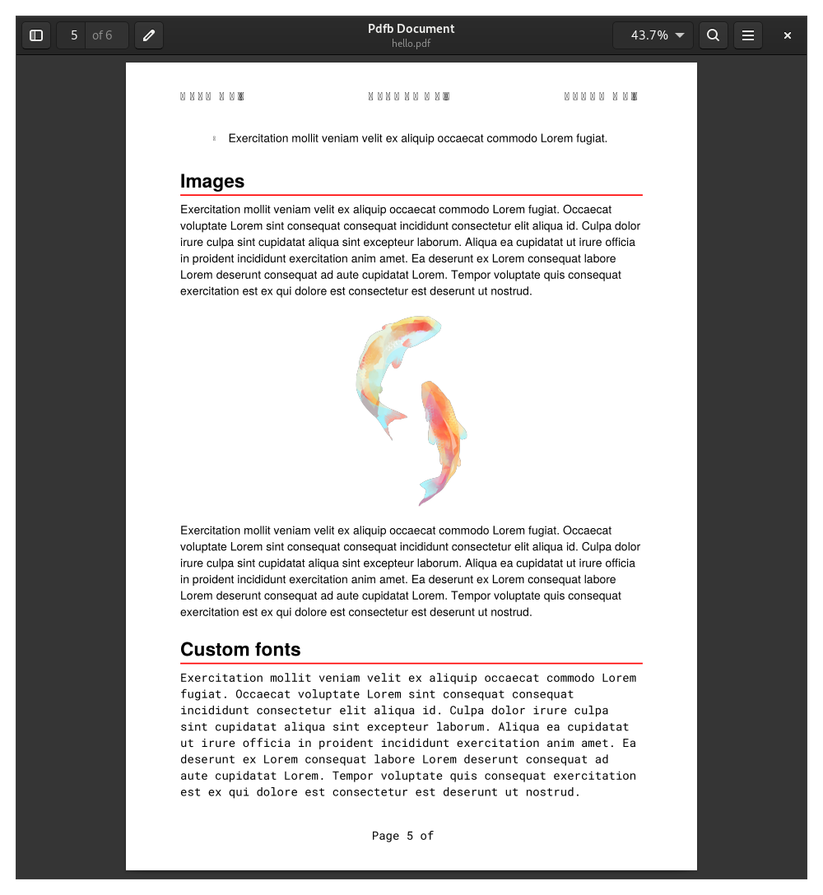

# 📄 PDFb

**NO LONGER MAINTAINED**

**This project has been suspended for an uncertain amount of time, development here may or may not continue in the future.**

A PDF document builder utilising the [gofpdf](https://github.com/jung-kurt/gofpdf) library by Kurt Jung to produce extensive and customisable PDF documents.

PDFb uses gofpdf to provide a number of useful methods for creating fully complete, featureful, and professional PDF documents with ease.

## Features:

- Table of contents
- Heading levels
- Paragraphs
- Bulleted and numbered nested lists
- Accent colours
- Drawing shapes (boxes, circles, lines)
- Headers and Footers
- Tables
- Page background
- Images and image filtering using [gift](https://github.com/disintegration/gift) (crop, flip, rotate, colour balance, grayscale, hue, saturation, blur, pixelation, and much more)
- Hyperlinks
- Export in base64 encoding

## Quickstart

```go
package main

import (
	"github.com/vqvw/pdfb"
)

func main() {
	pdf := pdfb.New()

	// PDF Metadata
	pdf.SetAuthor("John Smith")
	pdf.SetTitle("Pdfb Document")
	pdf.SetSubject("Building documents with Pdfb")
	pdf.SetKeywords([]string{"Pdfb", "Document", "Example"})

	// Table of Contents
	pdf.Page()
	pdf.ToC(1)

	// Headings
	pdf.Heading(1, "Heading")
	pdf.Heading(2, "Heading")
	pdf.Heading(3, "Heading")

	// Lists
	pdf.Heading(1, "Lists")
	pdf.List(
		[]pdfb.ListItem{
			{Level: 1, Text: "Foo"},
			{Level: 1, Text: "Bar"},
            {Level: 1, Text: "Baz"},
		},
	)
	pdf.Ln(1)

	// Images
	pdf.Heading(1, "Images")
	pdf.Image("./examples/hello/fish.png", "c", pdf.GetX(), pdf.GetY(), 0, 70)

    // Output
	pdf.SaveAs("examples/hello/hello.pdf")
}
```




